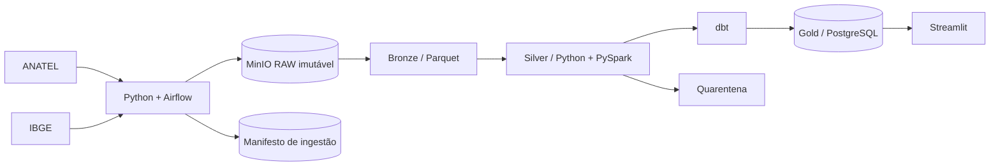

# Telecom Intelligence Brasil

## Brazilian Telecommunications Data Platform & Market Intelligence

Telecom Intelligence Brasil é uma plataforma de dados para integrar, validar e analisar
fontes públicas oficiais do setor brasileiro de telecomunicações. O produto transforma dados
da ANATEL e do IBGE em indicadores auditáveis de mercado, infraestrutura, conectividade,
competição e experiência do consumidor.

> Status: MVP de inteligência de banda larga fixa concluído e validado ponta a ponta. Indicadores
> só são publicados após ingestão, validação, reconciliação e documentação da fonte oficial.

## Problema

Dados públicos de telecomunicações estão distribuídos em conjuntos com granularidades,
esquemas e calendários diferentes. Isso dificulta comparar municípios e operadoras ao longo
do tempo sem uma camada consistente de engenharia e qualidade.

## Solução

Uma plataforma local reproduzível com ingestão idempotente, armazenamento RAW imutável,
arquitetura Medallion, quarentena de registros inválidos, modelagem dimensional, marts dbt e
um produto analítico em Streamlit.

## Arquitetura implementada



Detalhes e responsabilidades estão em [docs/architecture/overview.md](docs/architecture/overview.md).

## Tecnologias

Python, Pandas, PyArrow, PySpark (somente quando o volume justificar), Apache Airflow, MinIO,
PostgreSQL, dbt, Streamlit, Plotly, Pandera, Pytest, Ruff, Docker Compose e GitHub Actions.

## Execução local

Pré-requisitos: Python 3.11+ e PostgreSQL 16, ou Docker com Compose.

```bash
cp .env.example .env
make setup
make lint
make test
python scripts/load_gold_to_postgres.py
make dbt-run
make health
make dashboard
```

No Windows sem `make`, execute os comandos equivalentes descritos no `Makefile`.

## Resultados

O pipeline oficial processou 4.154.103 linhas ANATEL de janeiro a junho de 2026, consolidou
3.920.634 chaves únicas e reconciliou 339.886.848 acessos entre Silver, fact e marts. O
`dbt build` aprovou 28 de 28 recursos/testes e o health check está saudável.

Em junho de 2026: 56.609.491 acessos, 26,5248 acessos por 100 habitantes, 80,3633% em fibra e
94,9679% acima de 34 Mbps. A densidade usa população IBGE 2025 e não representa percentual de
pessoas conectadas.

## Roadmap

- [x] Estrutura inicial, configuração Python, qualidade e testes
- [x] Descoberta e validação das fontes oficiais usadas pelo MVP
- [x] Ingestão RAW, manifesto e idempotência para a fonte IBGE validada
- [x] Profiling e relatórios de qualidade do diretório municipal IBGE
- [x] Bronze municipal em Parquet com schema e lineage versionados
- [x] Silver municipal, normalização controlada e quarentena
- [x] Dimensões municipais e de data sustentadas pelas fontes atuais
- [x] População municipal IBGE 2025 em RAW, Bronze, Silver e `dim_municipality`
- [x] Extração seletiva e RAW oficial de banda larga fixa ANATEL 2026
- [x] Profiling incremental e definição do grão da banda larga fixa ANATEL 2026
- [x] Bronze tipada e particionada da banda larga fixa ANATEL 2026
- [x] Silver validada, deduplicada e reconciliada da banda larga fixa ANATEL 2026
- [x] Fact Gold reconciliada de acessos de banda larga fixa
- [x] Marts e KPIs de banda larga validados; modelos dbt preparados
- [x] Execução dbt/PostgreSQL com 28/28 recursos e testes aprovados
- [ ] Demais facts de telecom
- [x] KPIs e análises de negócio da banda larga fixa
- [x] Dashboard, observabilidade e documentação de portfólio

## Licença

Código sob licença MIT. Os dados permanecem sujeitos aos termos das instituições de origem,
que serão registrados no inventário de fontes.
