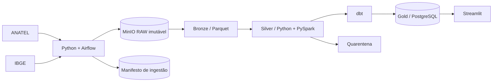

# Telecom Intelligence Brasil

Plataforma de Dados e Inteligência do Mercado Brasileiro de Telecomunicações

Telecom Intelligence Brasil é uma plataforma de dados para integrar, validar e analisar
fontes públicas oficiais do setor brasileiro de telecomunicações. O produto transforma dados
da ANATEL e do IBGE em indicadores auditáveis de mercado, infraestrutura, conectividade,
competição e experiência do consumidor.

> **Status:** MVP de inteligência de banda larga fixa concluído e validado ponta a ponta.
> Indicadores só são publicados após ingestão, validação, reconciliação e documentação da
> fonte oficial.

## Problema

Dados públicos de telecomunicações estão distribuídos em conjuntos com granularidades,
esquemas e calendários diferentes. Isso dificulta comparar municípios e operadoras ao longo
do tempo sem uma camada consistente de engenharia e qualidade.

## Solução

Uma plataforma local reproduzível com ingestão idempotente, armazenamento RAW imutável,
arquitetura Medallion, quarentena de registros inválidos, modelagem dimensional, marts dbt e
um produto analítico em Streamlit.

## Arquitetura implementada



Detalhes e responsabilidades estão em [docs/architecture/overview.md](docs/architecture/overview.md).

## Tecnologias

Python, Pandas, PyArrow, PySpark (somente quando o volume justificar), Apache Airflow, MinIO,
PostgreSQL, dbt, Streamlit, Plotly, Pandera, Pytest, Ruff, Docker Compose e GitHub Actions.

## Dashboard

O produto analítico apresenta uma visão executiva e responsiva da banda larga fixa, com:

- filtro de competência e contexto metodológico na parte superior;
- KPIs nacionais de acessos, densidade, fibra e alta velocidade;
- evolução mensal com comparação entre competências;
- ranking consolidado de prestadoras;
- participação por tecnologia e faixa de velocidade;
- ranking municipal com filtro por UF e nomes localizados em português.

Os gráficos exibem valores absolutos e participações nos detalhes interativos. O dashboard lê
os marts Parquet auditados em `data/gold/marts`, sem recalcular métricas no front-end.

## Instalação e execução local

Pré-requisitos: Python 3.11 ou 3.12. PostgreSQL 16 é necessário para dbt; Docker Compose é
opcional para subir a infraestrutura completa.

### Linux e macOS

```bash
cp .env.example .env
python -m pip install -e ".[dev,analytics,dashboard]"
make lint
make test
make health
make dashboard
```

### Windows PowerShell

```powershell
Copy-Item .env.example .env
python -m pip install -e ".[dev,analytics,dashboard]"
ruff check .
ruff format --check .
pytest
python scripts/check_platform_health.py
streamlit run streamlit/app.py
```

O dashboard estará disponível em `http://localhost:8501`. Para reconstruir o pipeline, execute
os scripts de `ingest` e `transform` listados no [Makefile](Makefile). A operação do PostgreSQL,
dbt e observabilidade está detalhada em [docs/operations.md](docs/operations.md).

### Publicação no Streamlit Community Cloud

O repositório inclui um snapshot compacto e auditado dos cinco marts necessários à demonstração
online. A aplicação publicada não exige PostgreSQL, MinIO, Airflow ou credenciais de fontes.

Na criação do app no Streamlit Community Cloud, use:

- repositório: `Wwerneck/telecom-intelligence-brasil`;
- branch: `master`;
- arquivo principal: `streamlit/app.py`;
- versão do Python: 3.12.

As dependências mínimas da implantação estão declaradas em `streamlit/requirements.txt`, ao lado
do arquivo principal. O snapshot online usa CSV compactado para evitar dependências binárias no
ambiente de deploy. Atualizações dos dados devem passar novamente pelo pipeline e pelas
reconciliações antes da substituição do snapshot publicado.

## Qualidade e auditabilidade

O projeto mantém controles em todas as camadas:

- RAW imutável e identificado por hash;
- manifesto de ingestão idempotente;
- contratos de schema e tipagem na Bronze;
- deduplicação governada, normalização e quarentena na Silver;
- reconciliação de linhas e acessos entre Silver, fact e marts;
- testes unitários, integração ponta a ponta, testes dbt e health check;
- CI com Ruff, verificação de formatação e Pytest.

Verificação mínima antes de publicar:

```bash
ruff check .
ruff format --check .
pytest
python scripts/check_platform_health.py
```

Quando PostgreSQL e dbt estiverem disponíveis:

```bash
python scripts/load_gold_to_postgres.py
cd dbt
dbt build --profiles-dir .
```

## Resultados

O pipeline oficial processou 4.154.103 linhas ANATEL de janeiro a junho de 2026, consolidou
3.920.634 chaves únicas e reconciliou 339.886.848 acessos entre Silver, fact e marts. O
`dbt build` aprovou 28 de 28 recursos/testes, a suíte Python possui 54 testes aprovados e o
health check está saudável. A quarentena da execução validada contém zero registros.

Em junho de 2026: 56.609.491 acessos, 26,5248 acessos por 100 habitantes, 80,3633% em fibra e
94,9679% acima de 34 Mbps. A densidade usa população IBGE 2025 e não representa percentual de
pessoas conectadas.

## Estrutura do repositório

| Caminho | Responsabilidade |
|---|---|
| `src/telecom_intelligence` | Ingestão, transformação, qualidade e métricas |
| `scripts` | Entradas operacionais reproduzíveis do pipeline |
| `dbt` | Modelos, testes e documentação da camada analítica SQL |
| `streamlit` | Dashboard executivo e identidade visual |
| `tests` | Testes unitários e integração ponta a ponta |
| `docs` | Arquitetura, decisões, fontes e operação |
| `reports` | Evidências versionadas de qualidade e observabilidade |

Dados intermediários, credenciais, logs e perfis locais do dbt são ignorados pelo Git. Somente o
snapshot Gold compacto usado na demonstração online é publicado. Use `.env.example` apenas como
modelo e nunca versione o arquivo `.env`.

## Roadmap

- [x] Estrutura inicial, configuração Python, qualidade e testes
- [x] Descoberta e validação das fontes oficiais usadas pelo MVP
- [x] Ingestão RAW, manifesto e idempotência para a fonte IBGE validada
- [x] Profiling e relatórios de qualidade do diretório municipal IBGE
- [x] Bronze municipal em Parquet com schema e lineage versionados
- [x] Silver municipal, normalização controlada e quarentena
- [x] Dimensões municipais e de data sustentadas pelas fontes atuais
- [x] População municipal IBGE 2025 em RAW, Bronze, Silver e `dim_municipality`
- [x] Extração seletiva e RAW oficial de banda larga fixa ANATEL 2026
- [x] Profiling incremental e definição do grão da banda larga fixa ANATEL 2026
- [x] Bronze tipada e particionada da banda larga fixa ANATEL 2026
- [x] Silver validada, deduplicada e reconciliada da banda larga fixa ANATEL 2026
- [x] Fact Gold reconciliada de acessos de banda larga fixa
- [x] Marts e KPIs de banda larga validados; modelos dbt preparados
- [x] Execução dbt/PostgreSQL com 28/28 recursos e testes aprovados
- [x] KPIs e análises de negócio da banda larga fixa
- [x] Dashboard, observabilidade e documentação de portfólio
- [ ] Demais facts e domínios de telecomunicações

## Licença

Código sob licença MIT. Os dados permanecem sujeitos aos termos das instituições de origem,
que serão registrados no inventário de fontes.
